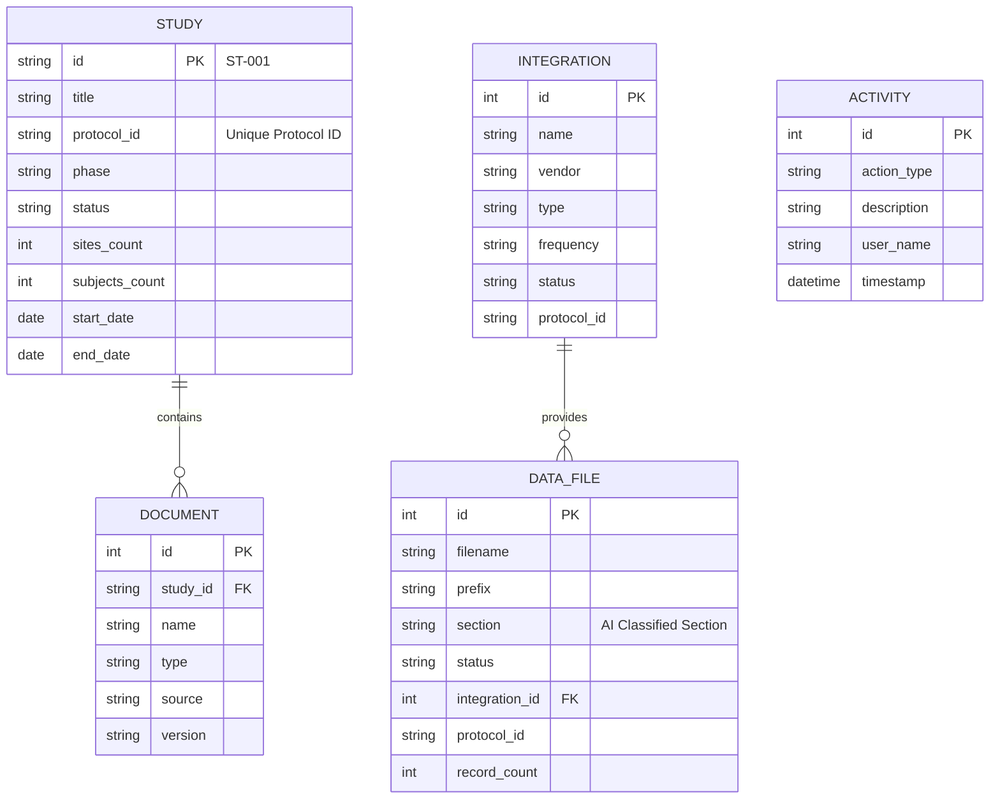

# Clinical Cosmos Data Schema

This document outlines the database schema for the Clinical Cosmos application, detailing the tables, keys, relationships, and how they map to the core features: Study Management, Data Integration, Trial Management, and Data Manager.ai.

## Entity Relationship Diagram

---

## Feature 1: Study Management

**Purpose**: Manages high-level study information, tracking progress, and storing related regulatory documents.

### Table: `studies`
*The core entity representing a clinical trial.*

| Column | Type | Key | Description |
|--------|------|-----|-------------|
| `id` | String | **PK** | Unique identifier (e.g., "ST-001"). |
| `title` | String | | Official title of the study. |
| `protocol_id` | String | | The regulatory protocol ID (e.g., "PRO-001"). serves as a logical link to other features. |
| `phase` | String | | Trial phase (I, II, III, IV). |
| `status` | String | | Current state (Planning, Active, Completed). |
| `sites_count` | Integer | | Number of active sites. |
| `subjects_count` | Integer | | Number of enrolled subjects. |
| `start_date` | Date | | Study start date. |
| `end_date` | Date | | Expected or actual end date. |
| `completion_percentage`| Integer | | Progress tracker (0-100). |

### Table: `documents`
*Documents associated with a specific study (Protocols, SAPs, etc).*

| Column | Type | Key | Description |
|--------|------|-----|-------------|
| `id` | Integer | **PK** | Auto-incrementing ID. |
| `study_id` | String | **FK** | Links to `studies.id`. |
| `name` | String | | Display name of the document. |
| `type` | String | | File type (pdf, docx). |
| `source` | String | | Source (Manual upload, eTMF Sync). |
| `file_url` | String | | Path or URL to the stored file. |

---

## Feature 2: Data Integration

**Purpose**: Configures connections to external data sources (EDC, Labs, ePRO) or local file systems.

### Table: `integrations`
*Configuration for data pipelines.*

| Column | Type | Key | Description |
|--------|------|-----|-------------|
| `id` | Integer | **PK** | Unique Integration ID. |
| `name` | String | | Friendly name for the integration. |
| `vendor` | String | | Data provider (Medidata, LabCorp, etc.). |
| `type` | String | | Type of data (EDC, Lab, Imaging). |
| `frequency` | String | | Sync frequency (Daily, Weekly, Real-time). |
| `status` | String | | Connection status (Active, Error). |
| `protocol_id` | String | | **Logical FK**: Links this integration to a specific `studies.protocol_id`. |
| `folder_path` | String | | Local path if scanning a file directory. |
| `last_sync` | DateTime | | Timestamp of the last successful sync. |

---

## Feature 3: Trial Management & Feature 4: Data Manager.ai

**Purpose**: 
- **Trial Management**: Listing, tracking, and viewing the actual clinical data files.
- **Data Manager.ai**: The `data_files` table is populated by the AI/Pattern Recognition logic which classifies files based on naming conventions (`prefix`) and maps them to clinical domains (`section`).

### Table: `data_files`
*Individual data datasets ingested from Integrations.*

| Column | Type | Key | Description |
|--------|------|-----|-------------|
| `id` | Integer | **PK** | Unique File ID. |
| `filename` | String | | Name of the file. |
| `prefix` | String | | **AI Extracted**: The short code identified in the filename (e.g., 'ae', 'dm'). |
| `section` | String | | **AI Mapped**: The clinical domain mapped from the prefix (e.g., 'Adverse Events'). |
| `status` | String | | Processing status (Imported, Unclassified, Duplicate). |
| `integration_id`| Integer | **FK** | Links to the `integrations` source. |
| `protocol_id` | String | | **Logical FK**: Links to `studies.protocol_id`. |
| `record_count` | Integer | | Number of records (rows) in the file. |
| `timestamp` | String | | Timepoint extracted from filename. |

---

## Cross-Feature Links

1.  **Study -> Integration**:
    *   Linked via `protocol_id`. A Study with Protocol "PRO-001" will automatically be associated with Integrations configured for "PRO-001".

2.  **Integration -> Data Files**:
    *   Linked via `integration_id` Foreign Key. An integration "produces" multiple data files.

3.  **Data Manager.ai -> Data Files**:
    *   The **Data Manager.ai** logic acts as the "Writer" for the `data_files` table. It scans raw input, applies logic:
        *   `filename` -> *Regex Analysis* -> `prefix`, `timestamp`
        *   `prefix` -> *Domain Knowledge Map* -> `section`
    *   This transforms raw files into structured "Trial Management" data.
